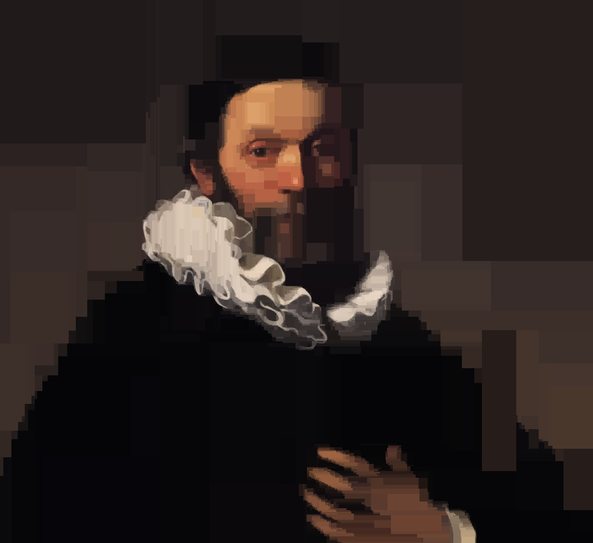

# The Art of Compression
#### CPSC 221 Assignment  
Uploaded with permission.  
Please do not submit this as your solution, as it would be considered cheating.  
  
## Objective:  
- Use Lossy Image Compression algorithms to compress a given image  

## Outcomes:  
- learned about algorithmic art  
- learn about an algorithm for lossy image compression  
- learn about space partitioning trees similar to KD Trees  
- learn about clever mechanisms for speeding up statistical algorithms  

## Examples:  
Rembrant paintings before and after:  
 
  
  
A picture of a UBC Totem Pole before and after:  
  

